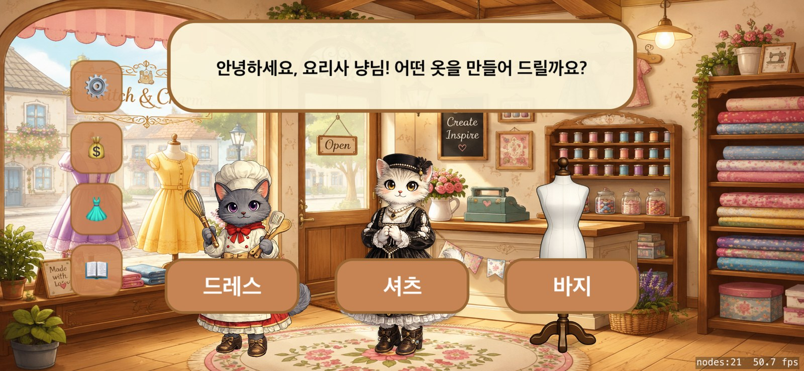
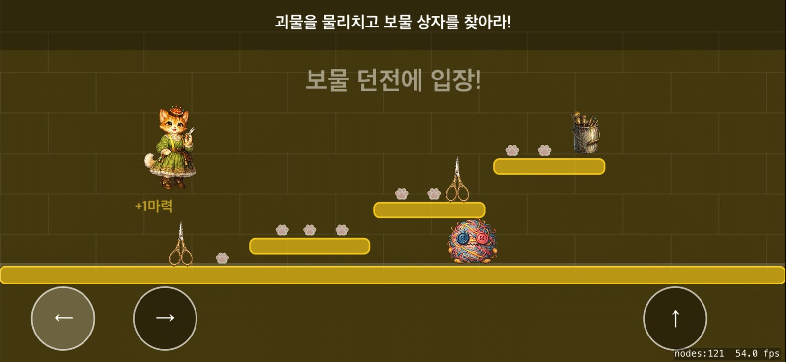
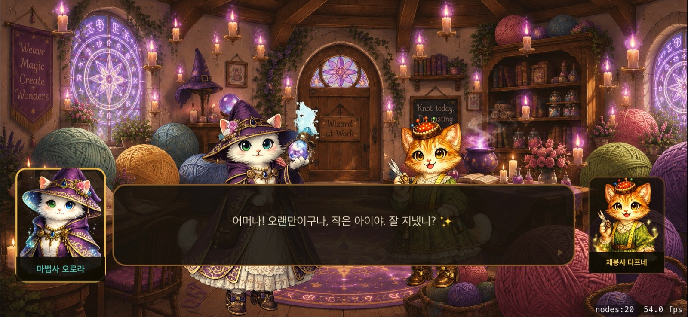

# 묘한 옷 공방 · The Purrfect Stitch

An iOS tailor-shop RPG for children, written in Swift and SpriteKit. A customer walks into a cat-run
tailor shop and places an order; the tailor takes it to the back room, and to actually make the garment
she has to go down into the dungeon beneath the workshop and win the fabric, thread, buttons and
mannequin back from what lives there. Korean-language, AI-generated art, no third-party dependencies —
~11,400 lines of Swift across 15 scenes, all laid out programmatically.



|  |  |
|---|---|

**📝 I write about how this gets built at [velog.io/@annyeong_birdie](https://velog.io/@annyeong_birdie)** —
the architecture, the AI-assisted workflow, and what it's like to build a game with an eight-year-old as
the design consultant. That's the fuller story; this repo is the code.

**Status:** private alpha. Sideloaded to physical devices for playtesting; not submitted to the App Store.

## Building

Open `DesignerAna.xcodeproj` in Xcode and run — there are no dependencies to fetch.

```bash
xcodebuild -project DesignerAna.xcodeproj -scheme DesignerAna \
  -destination 'id=<simulator-udid>' build
```

Use an explicit simulator UDID (`xcrun simctl list devices`); destination-by-name resolves ambiguously.

The Xcode project is still named `DesignerAna` — an early working title kept deliberately, since renaming
the project, scheme and source folder is pure regression risk for no functional gain.

---

*Art, story and code by [AnnyeongBirdie](https://github.com/AnnyeongBirdie) · Seoul*
